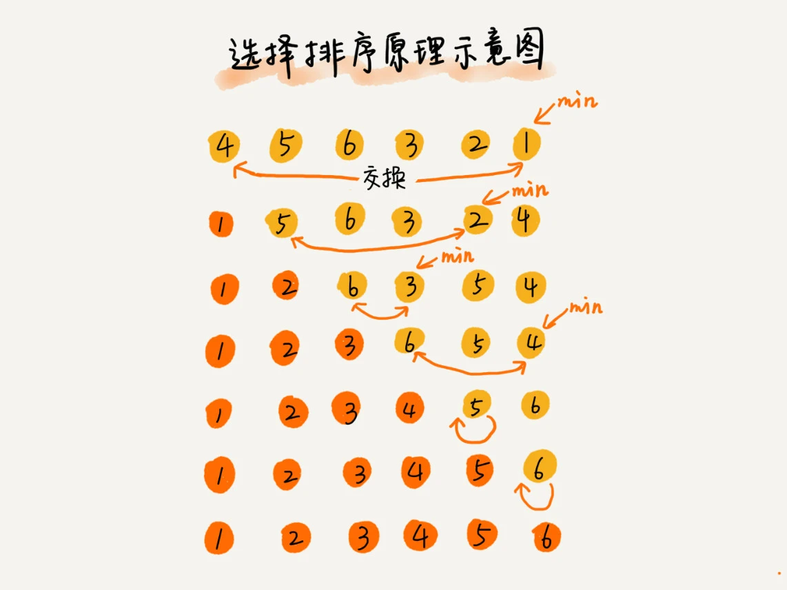

# 数据结构和算法

### 定义
广义上讲，数据结构就是**一组数据的存储结构**。算法是**操作数据的一组方法**。

### 数据结构和算法的关系
数据结构与算法是相辅相成的，数据结构是为算法服务的，算法是要作用在特定的数据结构上。

### 复杂度
定义：考量效率和资源消耗的方法。

### 常用的数据结构
数组、链表、栈、队列、散列表、二叉树、堆、跳表、图、Trie树等

### 常用的算法
递归、排序、二分查找、搜索、哈希算法、贪心算法、分治算法、回溯算法、动态规划、字符串匹配算法

### 怎么学
1. 边学边练，每周花1~2小时的时间集中公关三节课涉及的数据结构与算法，代码实现。
2. 主动提问、多思考、多互动。
3. 自我激励，每次学完都留下一篇学习笔记。  

  

# 如何分析、统计算法的执行效率与资源消耗
假设CPU运行一行代码的时间为unit_time  

实例一：

```java
 int cal(int n) {
   int sum = 0;
   int i = 1;
   for (; i <= n; ++i) {
     sum = sum + i;
   }
   return sum;
 }
```
第2、3行代码分别需要1个unit_time的执行时间,  
第4、5行代码需要执行n遍，所以需要2n\*unit_time的时间，  
所以这段代码的总执行时间为(2n+2)\*unit_time,  
可以看出，所有代码的执行时间 **T(n)** 与每行代码的执行次数成正比。  

实例二：

```java
 int cal(int n) {
   int sum = 0;
   int i = 1;
   int j = 1;
   for (; i <= n; ++i) {
     j = 1;
     for (; j <= n; ++j) {
       sum = sum +  i * j;
     }
   }
 }
```
第2、3、4行代码需要3\*unit_time的执行时间,  
第5、6行代码需要2n\*unit_time的执行时间，  
第7、8行代码需要2n^2\*unit_time的执行时间，  
总的执行时间为：$(2n^2+2n+3)*unit\_time$。  
所以，所有代码的执行时间**T(n)** 与每行代码的执行次数 **f(n)** 成正比。  

所以，第一个例子中的T(n)=O(2n+2),第二个例子中T(n)=O(2n^2+2n+3)。这就是大O时间复杂度表示法。大O时间复杂度实际上并不具体表示代码真正的执行时间，而是表示**代码执行时间随数据规模增长的变化趋势**，所以，也叫作**渐进时间复杂度**(asymptotic time complexity),简称复杂度。  

当n很大时，公式中低阶、常量、系数并不左右增长趋势，所以可以忽略。我们只需要记录一个最大量级即可。则刚刚两个例子中的复杂度可以分别记为$T(n)=O(2n)$ 和 $T(n)=O(n^2)$​

### 时间复杂度分析
##### 1.只关注循环次数最多的一段代码
我们通常会忽略掉常量、低阶、系数，只需要记录最大阶的量级就可以了。所以，**我们在分析一个算法，一段代码时间复杂度的时候，只需要关注循环执行次数最多的那一段代码就可以了**。这段核心代码执行次数n的量级，就是整段要分析代码的时间复杂度。  
##### 2.加法法则：总复杂等于量级最大的那段代码的复杂度
```java
int cal(int n) {
   int sum_1 = 0;
   int p = 1;
   for (; p < 100; ++p) {
     sum_1 = sum_1 + p;
   }

   int sum_2 = 0;
   int q = 1;
   for (; q < n; ++q) {
     sum_2 = sum_2 + q;
   }
 
   int sum_3 = 0;
   int i = 1;
   int j = 1;
   for (; i <= n; ++i) {
     j = 1;  
     for (; j <= n; ++j) {
       sum_3 = sum_3 +  i * j;
     }
   }
 
   return sum_1 + sum_2 + sum_3;
 }
```
该方法分别求sum\_1、sum\_2、sum\_3。则三段代码的空间复杂度分别为
$T(n)=O(1)$​​、$T(n)=O(n)$​​、$T(n)=O(n^2)$​​
我们取其中最大量级，所以整段代码的时间复杂度为$O(n^2)$​​​。
如果T<sub>1</sub>(n)=O(f(n)),T<sub>2</sub>(n)=O(g(n);那么$T(n)=T1(n)+T2(n)=max(O(f(n),O(g(n))=O(max(f(n),g(n))$​​.

##### 3.乘法法则：嵌套代码的复杂度等于嵌套内外代码复杂度的乘积
如果$T1(n)=f(n)$,$T2(n)=g(n)$;那么$T(n)=T1(n)*T2(n)=f(n)*g(n)$.  
也就是说，假设$T1(n)=O(n)$,$T2(n)=O(n^2)$,则$T1(n)*T2(n)=O(n^3)$。落实到具体例子，我们可以把乘法法则看成是嵌套循环，举个例子。  

```java
int cal(int n) {
    int ret = 0; 
    int i = 1;
    for (; i < n; ++i) {
        ret = ret + f(i);
    } 
} 
 
int f(int n) {
  int sum = 0;
  int i = 1;
  for (; i < n; ++i) {
    sum = sum + i;
  } 
  return sum;
}
```
### 几种常见的时间复杂度实例分析
  
非多项式量级：$O(2^n)$、$O(n!)$。其他为**多项式量级**。当数据规模n越来越大时，非多项式量级的执行时间会急剧增长，求解问题的执行时间会无线增长。所以非多项式量级是非常低效的算法。

##### 1. O(1)

```java
 int i = 8;
 int j = 6;
 int sum = i + j;
```
只要执行时间不随代码执行次数n的增大而增大，这样的代码的时间复杂度我们都记为O(1)。**一般情況下，只要算法中不存在循环语句、递归语句，即使有成千上万行代码，其时间复杂度也是O(1)**。
##### 2. O(logn)、O(nlogn)

```java
int i=1;
while(i <= n){
    i = i * 2;
}
```

由上图可得$n=2^x$
即$x=log_2n$，
所以这段代码的时间复杂度为$O(log_2n)$。

```java
 i=1;
 while (i <= n)  {
   i = i * 3;
 }
```
该代码的时间复杂度为$O(log_3n)$，但是$log_3n=log_2n*log_32$,$log_32$是一个常量，基于我们前面的理论，在采用大O标记时间复杂的时，可以忽略系数，及$O(log_2n*log_32)=O(log_2n)$。  

如果一段代码的时间复杂度为$O(log_2n)$,将该代码循环n遍，时间复杂度就会成为$O(nlog_2n)$。  
$O(nlog_2n)$也是一种很常见的时间复杂度，比如，归并排序、快速排序的时间复杂度都是$O(nlog_2n)$。

##### 3. O(n+m)、O(n*m)

```java
int cal(int m, int n) {
  int sum_1 = 0;
  int i = 1;
  for (; i < m; ++i) {
    sum_1 = sum_1 + i;
  }

  int sum_2 = 0;
  int j = 1;
  for (; j < n; ++j) {
    sum_2 = sum_2 + j;
  }

  return sum_1 + sum_2;
}
```
代码的复杂度由两个变量m,n来决定，这时加法法则就不生效了，因为我们不能确定m和n的量级，这时的时间复杂就成为$O(n+m)$,乘法法则依然有效。
### 空间复杂度分析
空间复杂度的全称是**渐进空间复杂度**(asymptotic space complexity),**表示算法的存储空间与数据规模之间的增长关系**.

```java
void print(int n) {
  int i = 0;
  int[] a = new int[n];
  for (i; i <n; ++i) {
    a[i] = i * i;
  }

  for (i = n-1; i >= 0; --i) {
    print out a[i]
  }
}
```
第二行代码申请了一个空间存储变量，是一个常量阶跟数据规模n没有关系，可以忽略，第三行申请了一个大小为n的int数组，除此之外没有其他的空间占用，所以空间复杂度就是$O(n)$。  

常见的空间复杂度有$O(1),O(n),O(n^2)$,像$O(nlog_2n),O(log_2n)$这样的对数阶复杂度平时都用不到。

### 内容小结
复杂度也叫渐进复杂度，包括时间复杂度和空间复杂度，用于分析算法的执行时间和存储空间与数据规模之间的增长关系。**越高阶的复杂度，执行效率越慢**.  
常见的复杂度由低阶到高阶依次为$O(1),O(n),O(logn),O(nlogn),O(n^2)$​​。


### 时间复杂度细分
最好情况时间复杂度，最坏情况时间复杂度，平均情况时间复杂度，均摊时间复杂度。  

其中平均时间复杂度又称**加权平均时间复杂度**或者**期望时间复杂度**。

# 数组：为什么很多编程语言中数组都是从0开始编号

**数组（array）是一种线性表数据结构，他用一组连续的内存空间，来存储一组具有相同类型的数据。**

**线性表：**数据排成像一条线一样的结构，线性表中只有前和后两个方向。除了数组，链表、队列、栈等也是线性表结构。


非线性表数据结构，如二叉树、堆、图等。之所以叫非线性表结构，是因为数据之前并不是简单只有前后关系。


计算机会给数组的每个内存单元分配内存地址，计算机通过内存地址来访问内存中的数据。当计算机需要访问某个数据时，会通过下面的内存地址计算公式，来获取该数据的内存地址：

```
a[i]_address = base_address + i * data_type_size
```

其中data_type_size表示数组中每个元素的大小，例如一个int数组，则他的data_type_size为4个字节。

**数组支持随机访问，根据下标随机访问的时间复杂度为O(1)**

### 低效的“插入”和“删除”操作

##### 插入操作

向数组中插入值时，从末端插入的时间复杂度为O(1),从中间的插入，需要将插入点后面的元素依次向后移，所以时间复杂度为O(n)。当不需要在意数组中元素的顺序是，我们可以将插入点的项移到数组末尾，将新的元素放在对应的位置。  

例如数组a[10]中储存了下面五个元素，a、b、c、d、e，现将元素x插入到a[2]的位置上，我们可以将c移到a[5]，将x放在a[2]，数组将成为a、b、x、d、e、c,时间复杂度就会降为O(1)。

##### 删除操作

删除数组中的一个值时，如果该值是数组的末尾，则时间复杂度为O(1);其他位置，由于需要先前补位时间复杂度为O(n)。

优化方案，当需要删除时，我们可以先记录一下已经删除的数据，而不是真正的将其删除，等数组没有空间是，进行一次删除操作，这样可以大大减少搬移数据的次数。（JVM中标记回收算法的思想）

##### 容器能否代替数组

1. 日常业务的话使用容器是很方便的，但是如果是追求性能，完成框架的开发，数组才是最好的选择。
2. 数组中可以存放int，long等基本类型的数据，autoboxing和unboxing还是有性能成本的。
3. 当要表示多维数组时，用数组往往更加直观一点。

##### 容器的使用小tip

容器的使用过程中，如果已知需要的容量，在初始化容器是，就给到对应的容量，可以减少频繁扩容的性能开销。

##### 开篇解答：为何通常数组的下标是从0开始的

在计算机寻址的过程中，如果下标从1开始，那么

```
a[i]_address = base_address + (i-1) * data_type_size
```

由上式子可以看出，CPU每一次的寻址操作，都要进行一次减法指令。下标从0开始，可以减少一个CPU指令。  

也有可能是历史原因，C语言设计这用0开始计数数组下标，之后的java，JavaScript高级语言都进行了效仿。

# 链表（上）：如何实现LRU缓存淘汰策略

### 链表与数组的区别

**底层存储结构 :** 数组需要一段连续的内存空间；链表则不需要，链表是通过“指针”将一组代码块串联起来使用。当我们有100MB以上的存储空间，申请100MB

的数组，可能申请失败，但是链表不会。


### 链表结构五花八门

常见的链表结构有：**单链表**、**双向链表**、**循环链表**

##### 单链表

链表通过指针将一组不连续的内存块串联起来。每一个代码块我们称为链表的节点，节点上不仅要存储数据，还要记录下个节点的地址。我们把这个记录下一个节点的指针称为**后继指针next**


我们习惯性的将第一个节点成为**头节点**，把最后一个几点成为**尾节点**。其中头结点存储的是链表的基地址，我们用头结点便可以获取到链表中的所有节点，尾节点指向了**null空地址**，这表示是链表的最后一个节点。

链表也支持插入、删除、查找操作。

相较于数组的插入删除操作，链表简单许多，不需要进行数据的搬移，因为链表存储结构本身就是不连续的内存块。


但是有利就有弊，在查找的过程中，因为是不连续的内存空间，所以无法像数组的查找操作那样，直接使用寻址公式计算得出对应的存储地址。链表的查找需要，从头节点开始挨个遍历，所以时间复杂度为$O(n)$​。

##### 循环链表

循环链表其实就是单链表的尾节点不指向null地址了，而是指向头结点


循环链表的优点是从链尾到链头非常方便。当要处理的数据具有环形特点时，就特别适合采用循环链表。比如注明的约瑟夫问题

##### 双向链表

单向链表每个节点只有一个后继指针(next)指向后一个节点，而双向链表不仅有后继指针(next)，还有一个前驱指针(prev)指向前面的节点。


确定：因为要存储一个前驱节点，所以需要更多的存储空间。

优点：可以支持O(1)的时间复杂度的情况下找到前驱节点，正是这样的特点，**双向链表在某些情况的插入、删除比单向链表简单高效**。

###### 为何高效

先看**删除操作**

在实际的软件开发过程中，删除操作通常两种情况：

- 删除节点中“值等于某个给定值”的节点；
- 删除给定指针指向的节点；

对于第一种情况，无论是单链表结构还是双向链表，都需要从头结点开始遍历，找到想要的节点，然后进行删除操作，删除操作的时间复杂度为O(1)，但是查找的时间复杂度为O(n)。根据时间复杂度分析的加法法则，取大量级的时间复杂度为O(n)。

对于第二种情况，我们知道要删除的节点，但是删除节点我们需要知道前驱节点，单链表不知道获取前驱节点，需要从头遍历，直到p->next=q，我们才能直到p是q的前驱节点。这种情况对于双向链表就很有优势了。

**插入操作**同理。

**查询操作：**对于有序链表，双向链表可以根据要查找的值选择查询方向，效率也会比单项列表高。

**LinkedHashMap**就是双向链表结构。

##### 双向循环链表


### 数组VS链表性能大比拼


在实际的软件开发过程中，不能单单根据时间复杂度来选择使用数组还是链表。

数组简单易用，在实现上使用的是连续的内存空间，可以借助CPU的缓存机制，预读数组中的数据，所以访问效率更高。数组的缺点是大小固定，需要使用连续的内容空间，当没有足够的连续的内存空间，会导致内存不足(out of memory)。如果声明数组过小，则可能出现不够用的情况。需要申请一个更大的数组，将其拷贝进新的数组中非常费时。链表本身支持动态扩容。

如果对于内存要求很苛刻，那么数组就更适合，因为链表的节点需要存储指向下个节点的指针，而且频繁的插入、删除操作，很容易产生内存碎片，导致JVM频繁的GC。

### 开篇解答

实现思路，维护一个有序单链表，越靠近链表尾部是越早之前访问的。当一个数据被访问是，我们从链表头开始顺序遍历链表。

1. 如果此数据之前已经被缓存在链表中了，那么遍历找到对应节点，将其删除，然后在插入到链表头部。
2. 如果此数据只掐没有被缓存在链表中，又可以分为两种情况
   1. 如果此时缓存未满，则直接将数据插入到链表头部
   2. 如果此时缓存已满，则将链表尾部的数据删除，将新数据插入到链表头部。

缓存访问的时间复杂度$O(n)$

**优化方案：**引入散列表来记录每个数据的位置，将访问的时间复杂度降为$O(1)$

# 链表（下）：如何轻松的写出正确的链表代码？

### 技巧一：理解指针或引用的含义

将某个变量赋值给指针，其实就是将这个变量的地址赋值给指针，换句话说，指针存储的是变量的内存地址，指向了这个变量，通过指针就可以找到这个变量。

p->next=q 我们可以说p节点的next指针存储了q的内存地址。

p->next=p->next->next p节点的next指针存储了p节点的下下一个节点的内存地址

### 技巧二：警惕指针丢失和内存泄漏


```
p->next = x;  // 将p的next指针指向x结点；
x->next = p->next;  // 将x的结点的next指针指向b结点；
```

上面的代码将会造成指针丢失

调转一下顺序即可。

### 技巧三：利用哨兵简化实现难度

针对链表的插入、删除操作，需要对插入的第一个结点和删除最后一个结点的情况进行特殊处理。

在任何适合，不管这个链表空不空，head指针都会一直指向这个哨兵结点。

因为哨兵结点一直存在，所以插入第一个结点和插入其他结点，删除第一个结点和删除其他结点，都可以统一为相同的代码实现逻辑。


### 技巧四：重点留意边界条件处理

- 如果链表为空时，代码是否能正常工作？
- 如果链表只包含一个结点时，代码是否能正常工作？
- 如果链表只包含两个结点时，代码是否能正常工作？
- 代码逻辑在处理头结点和尾结点时，代码是否能正常工作？

# 栈：如何实现浏览器的前进和后退功能

**后进者先出，先进者后出**

**栈是一种”操作受限“的线性表**，只允许在一端插入和删除数据。

### 栈在函数调用中的应用

##### 场景一：函数调用栈

操作系统给每个线程分配了一块内存空间，这块内存空间被组织成了栈的结构，用来存储函数调用时的临时变量。每次进入一个函数，就会将临时变量作为一个栈帧入栈，当函数调用结束，将这个函数对应的栈帧出栈。

##### 场景二：编译器如何运用栈来实现表达式求值

我们可以初始化两个栈，一个是数字栈，一个是运算符栈，然后遍历表达式，当遇到数字，直接将数字入到数字栈中，遇到运算符时，与栈顶元素比较优先级，如果运算符优先级高于栈顶元素，则直接入栈，如果低于或等于栈顶运算符的优先级，则从数字栈中取出两个数字，使用运算符栈顶元素进行计算，得出结果再入数字栈中，依次往复。


##### 场景三：栈在括号匹配中的应用

有三种括号任意组合“{”、“}”、“[”、“]”、“(”、“)”,比如，{[] ()[{}]}或[{()}([])]等都为合法格式。

我们可以初始化一个栈，遍历括号式子，当遇到左括号我们就进行入栈操作，当遇到有括号，就取出栈顶元素，如果能对上则合法，反之该式子不合法。直到遍历结束，如果栈中没有元素，则证明该式子合法，反之不合法。

# 队列：队列在线程池等有限资源池中的应用

**队列特点：先进先出，主要的两个操作入队和出队。**

栈只支持两个操作,**入栈push()**和**出栈pop()**。队列支持两个操作，**入队enqueue()**，放一个数据到队尾和**出队dequeue()**，从队列头部取出一个元素。


### 顺序队列和链式队列

跟栈一样，列队可以用数组实现，也可以使用链表实现，使用数组实现的栈叫做顺序栈，使用链表实现的栈叫做链式栈。使用数组实现的队列叫做**顺序队列**，使用链表实现的队列叫做**链式队列**。

数组实现队列

```java

// 用数组实现的队列
public class ArrayQueue {
  // 数组：items，数组大小：n
  private String[] items;
  private int n = 0;
  // head表示队头下标，tail表示队尾下标
  private int head = 0;
  private int tail = 0;

  // 申请一个大小为capacity的数组
  public ArrayQueue(int capacity) {
    items = new String[capacity];
    n = capacity;
  }

  // 入队
  public boolean enqueue(String item) {
    // 如果tail == n 表示队列已经满了
    if (tail == n) return false;
    items[tail] = item;
    ++tail;
    return true;
  }

  // 出队
  public String dequeue() {
    // 如果head == tail 表示队列为空
    if (head == tail) return null;
    // 为了让其他语言的同学看的更加明确，把--操作放到单独一行来写了
    String ret = items[head];
    ++head;
    return ret;
  }
}
```

上面实现方法，是一次性的，空间利用率太低了。

入队操作可以优化一下，当tail=n是我们可查看一下，数组是否真的满了，如果没有满，我们可以将元素向前平移。

```java

   // 入队操作，将item放入队尾
  public boolean enqueue(String item) {
    // tail == n表示队列末尾没有空间了
    if (tail == n) {
      // tail ==n && head==0，表示整个队列都占满了
      if (head == 0) return false;
      // 数据搬移
      for (int i = head; i < tail; ++i) {
        items[i-head] = items[i];
      }
      // 搬移完之后重新更新head和tail
      tail -= head;
      head = 0;
    }
    
    items[tail] = item;
    ++tail;
    return true;
  }
```


### 循环队列

为了避免数据迁移。可以考虑将顺序链表做成一个环。


循环队列的难点在于队空和队满的判定条件，在使用数组实现非循环队列时，队满的判定条件是**tail==n**(队列容量),队空的判定条件是**head==tail**。循环队列的**队空**判定条件依然是**head==tail**,队满的判定条件为**(tail+1)%n==head**。


```java

public class CircularQueue {
  // 数组：items，数组大小：n
  private String[] items;
  private int n = 0;
  // head表示队头下标，tail表示队尾下标
  private int head = 0;
  private int tail = 0;

  // 申请一个大小为capacity的数组
  public CircularQueue(int capacity) {
    items = new String[capacity];
    n = capacity;
  }

  // 入队
  public boolean enqueue(String item) {
    // 队列满了
    if ((tail + 1) % n == head) return false;
    items[tail] = item;
    tail = (tail + 1) % n;
    return true;
  }

  // 出队
  public String dequeue() {
    // 如果head == tail 表示队列为空
    if (head == tail) return null;
    String ret = items[head];
    head = (head + 1) % n;
    return ret;
  }
}
```

### 如何实现无锁并发队列

在入队之前，检查tail位置，入队时比较tail是否发生变化，如果否，则允许入队，反之入队失败。出队时则获取head位置，进行cas。

# 递归

### 递归需要满足三个条件

1. 一个问题的解可一分为多个子问题的解
2. 这个问题分解之后的子问题，除了数据规模不同，求解思路完全一样
3. 存在递归终止条件

假如这里有 n 个台阶，每次你可以跨 1 个台阶或者 2 个台阶，请问走这 n 个台阶有多少种走法？如果有 7 个台阶，你可以 2，2，2，1 这样子上去，也可以 1，2，1，1，2 这样子上去，总之走法有很多，那如何用编程求得总共有多少种走法呢？

我们仔细想下，实际上，可以根据第一步的走法把所有走法分为两类，第一类是第一步走了 1 个台阶，另一类是第一步走了 2 个台阶。所以 n 个台阶的走法就等于先走 1 阶后，n-1 个台阶的走法 加上先走 2 阶后，n-2 个台阶的走法。用公式表示就是：
$$
f(n) = f(n-1)+f(n-2)
$$
公式转化为代码

```java
int f(int n) {
  if (n == 1) return 1;
  if (n == 2) return 2;
  return f(n-1) + f(n-2);
}
```

### 递归代码要警惕堆栈溢出

我们可以在代码中维护一个int数来代表递归深度，达到某个深度值就返回或抛异常。

### 递归代码要避免重复计算


从图中，我们可以直观地看到，想要计算 f(5)，需要先计算 f(4) 和 f(3)，而计算 f(4) 还需要计算 f(3)，因此，f(3) 就被计算了很多次，这就是重复计算问题。

解决：我们可以引入map，计算前，先从map中取一下看是否存在。

理论上递归代码都可以改写为非递归代码，递归本质上是使用jvm提供的栈结构，我们也可以自己实现一个栈来改写递归代码。

### 调试递归

1. 打印日志发现，递归值。
2. 结合条件断点进行调试。

# 排序(上)：为什么插入排序比冒泡排序受欢迎？


## 如何分析一个“排序算法”？

### 排序算法执行效率

##### 1.最好情况、最坏情况、平均情况时间复杂度

##### 2.时间复杂度的系数、常数、低阶

在实际软件开发中，我们排序的数据规模可能是10个、100个、1000个这种小规模的数据量，所有需要考虑系数、常数、低阶也考虑进来。

##### 3.比较次数和交换（或移动）次数

### 排序算法的内从消耗

我们把空间复杂度为O(1)的排序算法叫做**原地排序**

### 排序算法的稳定性

比如我们有一组数据 2，9，3，4，8，3，按照大小排序之后就是 2，3，3，4，8，9。

这组数据里有两个 3。经过某种排序算法排序之后，如果两个 3 的前后顺序没有改变，那我们就把这种排序算法叫作**稳定的排序算法**；如果前后顺序发生变化，那对应的排序算法就叫作**不稳定的排序算法**。

### 冒泡排序(Bubble Sort)

冒泡排序只会操作相邻的两个数。每次冒泡操作都会对相邻的两个元素进行比较，看是否满足大小关系要求。如果不满足就互换，一次冒泡会让至少一个元素移动到正确的位置。重复n次，就完成了n个数据的排序。


当没有需要排序的元素是可以提前跳出

```java
// 冒泡排序，a表示数组，n表示数组大小
public void bubbleSort(int[] a, int n) {
  if (n <= 1) return;
 
 for (int i = 0; i < n; ++i) {
    // 提前退出冒泡循环的标志位
    boolean flag = false;
    for (int j = 0; j < n - i - 1; ++j) {
      if (a[j] > a[j+1]) { // 交换
        int tmp = a[j];
        a[j] = a[j+1];
        a[j+1] = tmp;
        flag = true;  // 表示有数据交换      
      }
    }
    if (!flag) break;  // 没有数据交换，提前退出
  }
}
```

##### 冒泡排序是原地排序算法吗？

​	冒泡排序是原地排序算法

##### 冒泡排序是稳定排序吗?

​	冒泡排序是稳定的排序算法顺序，只有在元素顺序不对是，才会进行交换操作

##### 冒泡排序的复杂度

​	最好情况复杂度为O(n),最坏情况复杂度为$O(n^2)$，平均情况复杂度为$O(n^2)$。

### 插入排序(Insertion Sort)

**核心思想：**将数组分为两个区间，**已排序区间**和**未排序区间**。初始已排序区间就一个元素，取未排序区间的元素插入到已排序区间合适的位置上。


```java
// 插入排序，a表示数组，n表示数组大小
public void insertionSort(int[] a, int n) {
  if (n <= 1) return;

  for (int i = 1; i < n; ++i) {
    int value = a[i];
    int j = i - 1;
    // 查找插入的位置
    for (; j >= 0; --j) {
      if (a[j] > value) {
        a[j+1] = a[j];  // 数据移动
      } else {
        break;
      }
    }
    a[j+1] = value; // 插入数据
  }
}
```

##### 插入排序是原地排序吗？

​	插入排序是原地排序，空间复杂度为O(1)。

##### 插入排序是稳定的排序算法吗？

​	我们可以将值插入到相同值的后面，所有插入排序是稳定的排序算法。

##### 插入排序的时间复杂度

最好情况复杂度$O(n)$

最坏情况复杂度$O(n^2)$

插入一个数据的时间复杂度为$O(n)$,需要循环n次，所以平均时间复杂度为$O(n^2)$

### 选择排序(Selection Sort)



选择排序也区分已排序区和未排序区，从未排序区中找到最小值，放到已排序区的尾部。

选择排序是原地排序，空间复杂度为$O(1)$

选择排序的时间复杂度不管什么情况都为$O(n^2)$

选择排序不是稳定排序。

### 开篇解答

冒泡排序不管怎么优化，元素交换的次数是一个固定值，是原始数据的逆序度。插入排序是同样的，不管怎么优化，元素移动的次数也等于原始数据的逆序度。

```java
冒泡排序中数据的交换操作：
if (a[j] > a[j+1]) { // 交换
   int tmp = a[j];
   a[j] = a[j+1];
   a[j+1] = tmp;
   flag = true;
}

插入排序中数据的移动操作：
if (a[j] > value) {
  a[j+1] = a[j];  // 数据移动
} else {
  break;
}
```

冒泡排序需要进行三次赋值操作，而插入排序只需要一次。当优化到极致，插入排序是比冒泡排序快的。

### 小结


# 排序(下)：如何运用快排思想在O(n)内查找第K大元素

### 归并排序原理

先将数组从中间分为前后两部分，然后对前后两部分分别排序，再将排序好的两部分合并在一起。


归并排序主要使用的是**分治思想**。顾名思义，就是分而治之，将一个大的问题分成多个小的问题来解决。

分治是一种解决问题的处理思想，递归是一种编程技巧。

```
递推公式：
merge_sort(p…r) = merge(merge_sort(p…q), merge_sort(q+1…r))

终止条件：
p >= r 不用再继续分解
```

转为代码

```java
// 归并排序算法, A是数组，n表示数组大小
merge_sort(A, n) {
  merge_sort_c(A, 0, n-1)
}

// 递归调用函数
merge_sort_c(int[] a,int p,int r) {
  // 递归终止条件
  if (p >= r){
      return;
  } 

  // 取p到r之间的中间位置q
  q = (p + r) / 2
  // 分治递归
  merge_sort_c(A, p, q)
  merge_sort_c(A, q+1, r)
  // 将A[p...q]和A[q+1...r]合并为A[p...r]
  merge(A[p...r], A[p...q], A[q+1...r])
}
```

merge代码实现，可以建一个【r-p】长的数组，将两个小的数组合并到新的数组中。

### 归并排序的性能分析

##### 第一，归并排序是稳定的排序算法吗？

在两个数组归并时，我们可以将前面的数组中的值不动，将后面数组的值填在相同值得后面，所以归并排序是稳定排序算法。

##### 第二，归并排序的时间复杂度是多少？

```

T(n) = 2*T(n/2) + n
     = 2*(2*T(n/4) + n/2) + n = 4*T(n/4) + 2*n
     = 4*(2*T(n/8) + n/4) + 2*n = 8*T(n/8) + 3*n
     = 8*(2*T(n/16) + n/8) + 3*n = 16*T(n/16) + 4*n
     ......
     = 2^k * T(n/2^k) + k * n
     ......
```

时间复杂度为$O(nlogn)$,最好情况和最坏情况的时间复杂度都是$O(nlogn)$

##### 第三，归并排序的空间复杂度是多少？

归并排序的空间复杂度为$O(n)$

### 快速排序的原理

快速排序是取数组中的任意值pivot，将数组分为两部分，比pivot小的和比pivot大的。


递归公式

```
递推公式：
quick_sort(p…r) = quick_sort(p…q-1) + quick_sort(q+1… r)

终止条件：
p >= r
```

```
// 快速排序，A是数组，n表示数组的大小
quick_sort(A, n) {
  quick_sort_c(A, 0, n-1)
}
// 快速排序递归函数，p,r为下标
quick_sort_c(A, p, r) {
  if p >= r then return
  
  q = partition(A, p, r) // 获取分区点
  quick_sort_c(A, p, q-1)
  quick_sort_c(A, q+1, r)
}
```

如果不考虑空间消耗，我们可以在合并的时候，初始化一个新的数组合并两个数据。


​	我们也可以原地合并，不需要重新开辟新的内存空间，伪代码

```java

partition(A, p, r) {
  pivot := A[r]
  i := p
  for j := p to r-1 do {
    if A[j] < pivot {
      swap A[i] with A[j]
      i := i+1
    }
  }
  swap A[i] with A[r]
  return i

```

快速排序不是稳定的排序算法

快速排序是原地排序算法，空间复杂度为$O(1)$

快速排序的时间复杂度是$O(nlogn)$,最坏情况复杂度是$O(n^2)$

### 课后思考

现在你有 10 个接口访问日志文件，每个日志文件大小约 300MB，每个文件里的日志都是按照时间戳从小到大排序的。你希望将这 10 个较小的日志文件，合并为 1 个日志文件，合并之后的日志仍然按照时间戳从小到大排列。如果处理上述排序任务的机器内存只有 1GB，你有什么好的解决思路，能“快速”地将这 10 个日志文件合并吗？


分别读十个文件的第一条日志比较日期，把最小日志的写入到新的文件里，并读取刚刚取日志的文件的第二条日志，依次读取插入。

# 线性排序：如何根据年龄给100万用户数据排序

### 桶排序(Bucket Sort)

**核心思想：**就是将数据分到几个有序的“桶”中，每个“桶”再单独的排序。桶内排序之后，在把每个桶里的数据依次顺序取出，组成的序列就是有序的了。


如果要排序的数据有n个，我们把他们平均分到m个桶中，那么每个桶中的数据个数就是k=n/m。每个桶中的数据使用快速排序的时间复杂度为$O(k*logk)$,有m个桶则$O(m*k*logk)$,将k带入$O(n*log(n/m))$ 。当桶个数m接近n时，$log(n/m)$就是一个非常小的常量。这时候桶排序的时间复杂度就接近O(n)。

### 计数排序(Counting Sort)

计数排序其实是一种特殊的桶排序。当要排序的n个数据，所处的范围不大的时候，比如最大值是k，我们就可以划分k个桶。每个桶的值都是相同的，省掉桶内排序的时间。

步骤:

1. 初始化一个数组A来记录各个数据出现的次数，数组中的值是对应下标出现的次数.(这时直接输出结果的时间复杂度是$O(n^2)$)

2. 再将数组A进行累加。

3. 这时数组中的值减一就是对应下标数值在结果数组中的位置。

   ```java
   
   // 计数排序，a是数组，n是数组大小。假设数组中存储的都是非负整数。
   public void countingSort(int[] a, int n) {
     if (n <= 1) return;
   
     // 查找数组中数据的范围
     int max = a[0];
     for (int i = 1; i < n; ++i) {
       if (max < a[i]) {
         max = a[i];
       }
     }
   
     int[] c = new int[max + 1]; // 申请一个计数数组c，下标大小[0,max]
     for (int i = 0; i <= max; ++i) {
       c[i] = 0;
     }
   
     // 计算每个元素的个数，放入c中
     for (int i = 0; i < n; ++i) {
       c[a[i]]++;
     }
   
     // 依次累加
     for (int i = 1; i <= max; ++i) {
       c[i] = c[i-1] + c[i];
     }
   
     // 临时数组r，存储排序之后的结果
     int[] r = new int[n];
     // 计算排序的关键步骤，有点难理解
     for (int i = n - 1; i >= 0; --i) {
       int index = c[a[i]]-1;
       r[index] = a[i];
       c[a[i]]--;
     }
   
     // 将结果拷贝给a数组
     for (int i = 0; i < n; ++i) {
       a[i] = r[i];
     }
   }
   ```

总结，计数排序只能在数据范围不大的场景中使用，数据范围k比要排序的数据n大很多，就不适合使用计数排序了。而且计数排序只能对非负整数使用。比如数据范围是[-1000,1000],我们要把所有的数据都加1000再进行计数排序。

### 基数排序(Radix Sort)

基数排序对要排序的数据是有要求的，需要可以分割出独立的“位”来比较，而且位之间的递进的关系，如果a数据比b数据大，那剩下的低位就不用了比较了。除此之外，每一位的数据范围不能太大，要可以使用线性排序算法进行排序，否则基数排序时间复杂度无法做到$O(n)$.

​	
